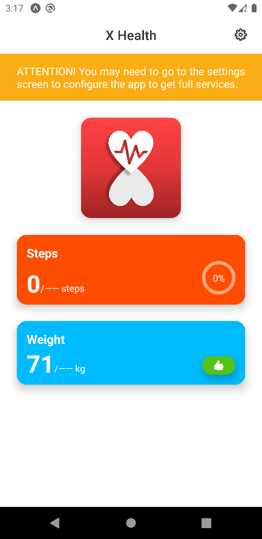
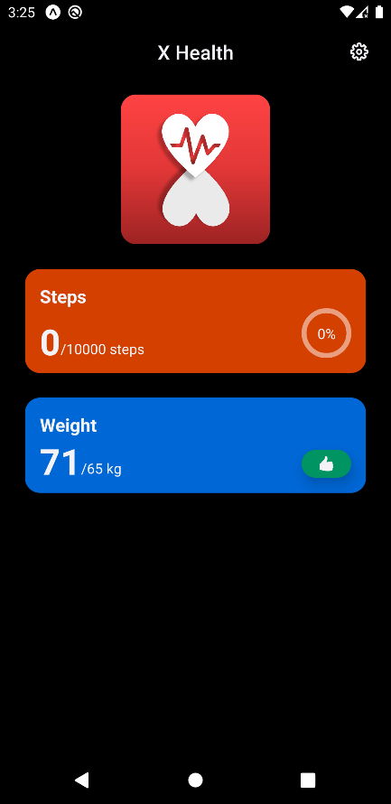
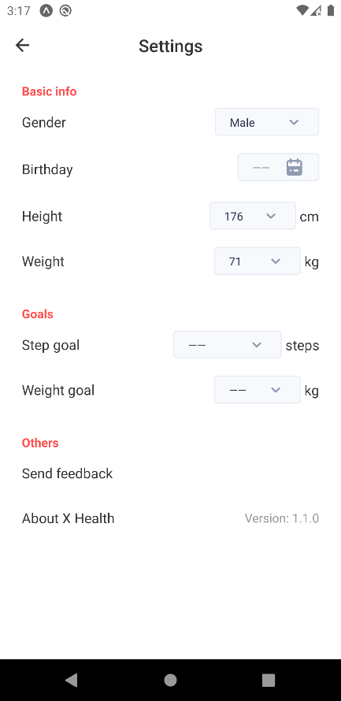
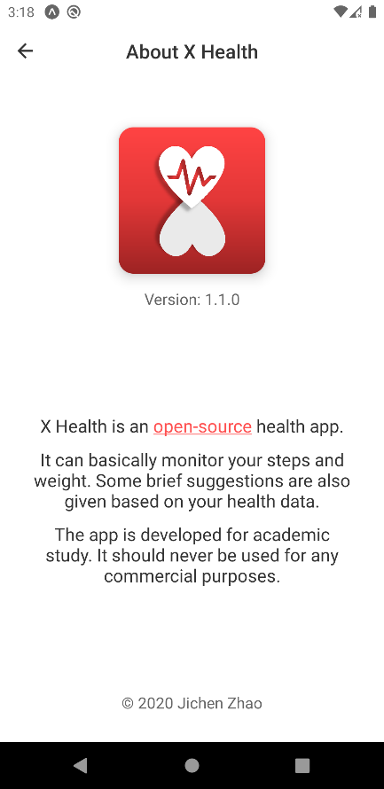
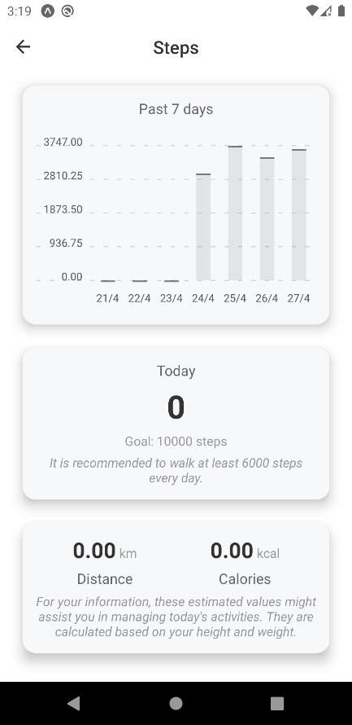
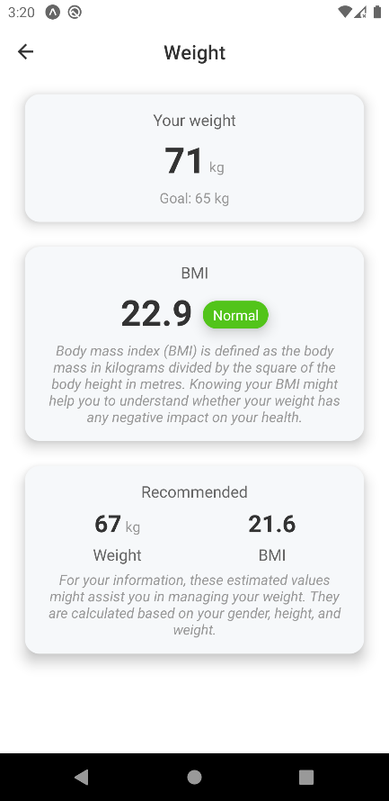

# [UoL_Y3S2_CPD](https://github.com/ArvinZJC/UoL_Y3S2_CPD)/A1

The app is a React Native app set up by Expo CLI developed as the artefact of Assessment 1 of the course **Cross-Platform Development** during Semester 2 of Year 3 of BSc (Hons) Computer Science in UoL. It uses Expo managed workflow. Its name is **X Health** and it can basically monitor the user's steps and weight. It is not a perfect one, but reflects the knowledge gained from the course. Some screenshots are shown as follows (Figures 1 - 6). For more info about the app, please turn to the relevant report.

Figure 1
Figure 2
Figure 3
Figure 4
Figure 5
Figure 6

## ATTENTION

1. By 29 April 2020, everything looks good with VS Code + Node.js 13.8.0. For more basic info about the packages/dependencies used, please refer to [the specified JSON file](https://github.com/ArvinZJC/UoL_Y3S2_CPD/blob/master/A1/package.json).
2. You can type `npm install` in the comand prompt to install all dependencies of the app.
3. As per the requirements and limitations of some dependencies from Expo, the app supports Android 6 - 9 and iOS.
4. The app has been published [here](https://expo.io/@arvinzjc/A1) on Expo.