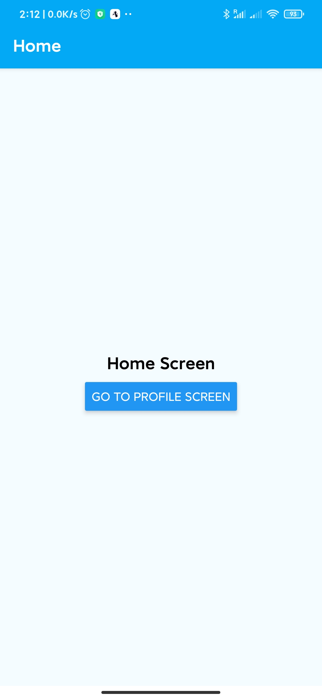
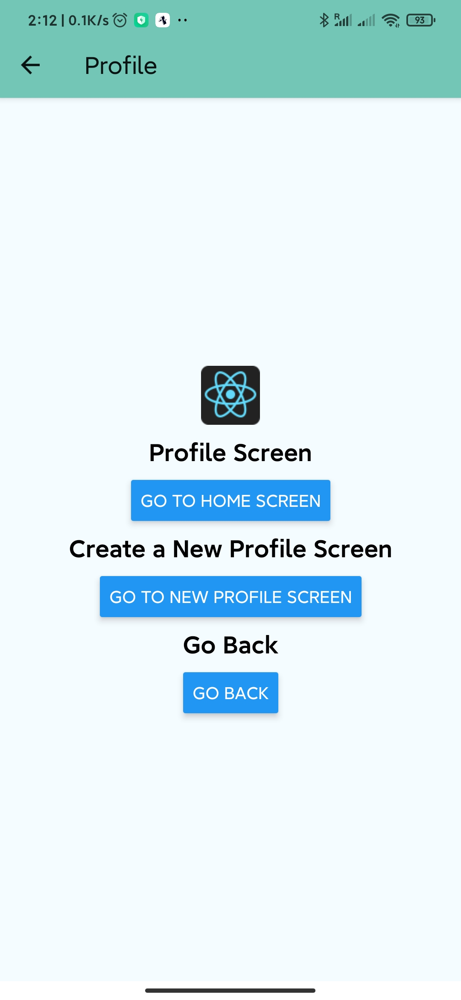

# [UoL_Y3S2_CPD](https://github.com/ArvinZJC/UoL_Y3S2_CPD)/W1

In this project, there is a Snack app developed in the Week 1's workshop. You can find the source code of the app [here](https://snack.expo.io/@arvinzjc/w1). The app is my first Snack app and it enables the user to switch between the home activity and the profile activity. It can also create a new profile screen.

The app is developed using Expo which is an open-source platform for making universal native apps for Android, iOS, and the web with JavaScript and React. You can preview the changes directly on your phone or tablet by clicking the **Run** button or use the simulator by clicking **Tap to Play**. By 31 March 2020, everything looks good with the platform. Some screenshots are shown as follows (Figures 1 & 2).

Figure 1
Figure 2

When you are ready to see everything that Expo provides (or if you want to use your own editor), you can **Export** your project and use it with [Expo CLI](https://docs.expo.io/versions/latest/introduction/installation.html).

Snack is open-source. You can find the code in [the specified repository on GitHub](https://github.com/expo/snack-web).