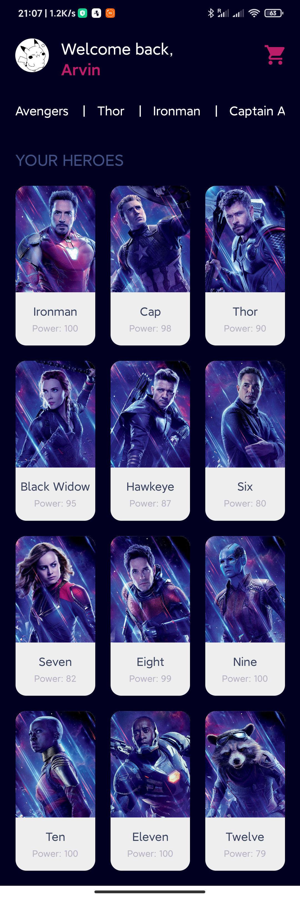

# [UoL_Y3S2_CPD](https://github.com/ArvinZJC/UoL_Y3S2_CPD)/W5

The app is my first React Native app set up by Expo CLI developed in the Week 5's workshop. It uses Expo managed workflow. It is not a kind of practical apps but just used to practise and to better understand some basic knowledge of React Native, Expo, and styling. Some screenshots are shown as follows (Figures 1 & 2).

Figure 1
Figure 2

## ATTENTION

1. By 29 April 2020, everything looks good with VS Code + Node.js 13.8.0. For more basic info about the dependencies used, please refer to [the specified JSON file](https://github.com/ArvinZJC/UoL_Y3S2_CPD/blob/master/W5/package.json).
2. You can type `npm install` in the comand prompt to install all dependencies of the app.